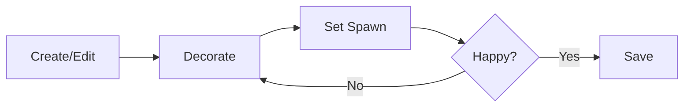

# Lobby Layouts

The default lobby is a plain cabin interior. Transform it into something that reflects your server's personality: add furniture, change wallpapers, set a custom spawn point.


## What You Can Customize

- **Furniture**: chairs, tables, plants, rugs, lamps, decorations
- **Wallpaper & Flooring**: per-room customization
- **Objects**: craftables and machines (decorative only in the lobby)
- **Spawn Point**: where players appear when they join

## Layout Editing Workflow



## Creating Your First Layout

As an admin, type this command in chat:

```
!lobby create welcome-room
```

You'll be warped into an editing cabin with [special protections](#edit-mode-features): permanent daylight, sleep immunity, no stamina drain.

Now decorate! Place furniture, apply wallpaper, set up the flooring. Make it feel like home.

## Setting the Spawn Point

Stand where you want players to appear and type:

```
!lobby spawn
```

::: tip Spawn Point Tips
- Place a sign near the spawn with instructions (e.g., "Type !login YOUR_PASSWORD")
- Keep it away from furniture so players don't spawn inside objects
- Consider the flow: where will players naturally look first?
:::

## Saving Your Layout

When you're happy with your creation:

```
!lobby save
```

Your layout is saved and you're teleported back to where you were before editing.

## Activating the Layout

```
!lobby set welcome-room
```

All new unauthenticated players will now see your custom lobby!

## Edit Mode Features

When editing a layout, you enter a special editing state:

| Feature              | Description                                                  |
| -------------------- | ------------------------------------------------------------ |
| **Permanent Daylight** | Time appears frozen for you, no rushing to bed             |
| **Sleep Immunity**   | Other players can sleep and end the day without affecting you |
| **Stamina/Health Lock** | No exhaustion or damage while decorating                  |
| **Auto-Teleport**    | Returns you to your previous location on save/cancel         |

::: tip Multiplayer Safe
Other players can continue playing normally while you edit. When they go to sleep, you'll keep editing. The day transition won't interrupt you.
:::

## Layout Name Rules

Layout names must follow these rules:

- **Allowed characters:** Letters, numbers, dashes (`-`), underscores (`_`)
- **Maximum length:** 32 characters
- **No spaces:** Use dashes instead (e.g., `my-cool-lobby`)
- **Reserved name:** `default` cannot be renamed or deleted

Examples:

- ✅ `welcome-room`
- ✅ `cozy_cabin_v2`
- ✅ `lobby01`
- ❌ `my cool lobby` (no spaces)
- ❌ `lobby@home!` (no special characters)

## Sharing Layouts

Created an amazing lobby? Share it with other server owners!

### Exporting

```
!lobby export welcome-room
```

You'll receive a string like:

```
SDVL0H4sIAAAAAAAAA6tWKkktLlGyUNJR...
```

This is a compressed, encoded snapshot of your entire layout: furniture positions, rotations, wallpaper, flooring, spawn point, everything.


### Importing

Got a layout string from someone? Import it:

```
!lobby import cozy-cabin SDVL0H4sIAAAAAAAAA6tWKkktLlGyUNJR...
```

The layout is now available on your server. Use `!lobby set cozy-cabin` to activate it.

::: tip Community Layouts
Share your favorite layouts on Discord or GitHub! The export format is version-tagged (`SDVL0`) for future compatibility.
:::

::: warning Export String Too Long
The export also prints to the server console (SMAPI logs). Copy it from there for easier handling.
:::
